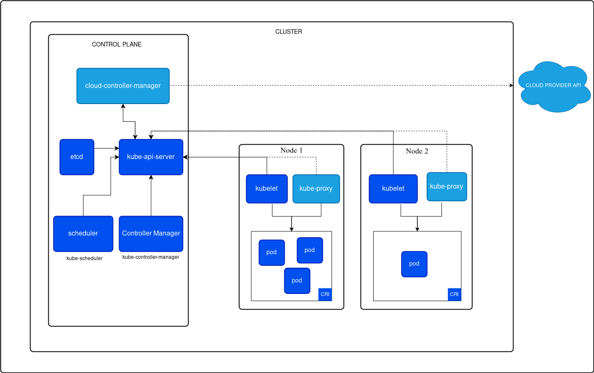

# Arquitetura do Kubernetes

O Kubernetes é uma plataforma de código aberto que simplifica o gerenciamento de containers, garantindo que as aplicações funcionem de forma eficiente, escalável e sempre disponível. Na prática, ele funciona como um “gerenciador, que cuida de distribuir as aplicações entre diferentes máquinas (nodes), recupera serviços automaticamente quando algo falha e permite atualizações sem interrupções no sistema.

Sua importância cresce principalmente em aplicações baseadas em microsserviços, onde os sistemas são divididos em pequenos componentes independentes. Gerenciar tudo manualmente seria inviável, e é aqui que o Kubernetes atua: ele automatiza tarefas como escalonamento de aplicações, alocação de recursos e organização da comunicação entre os serviços. Além disso, ele é extremamente flexível, funcionando tanto em nuvens públicas (como AWS, Google Cloud e Azure) quanto em servidores locais e em ambientes híbridos.

Empresas como Google, Netflix, Spotify e Reddit usam o Kubernetes para garantir que suas aplicações suportem milhões de acessos sem falhas. A plataforma é capaz de aumentar ou reduzir os recursos automaticamente conforme a demanda, manter os serviços disponíveis mesmo quando algum componente falha e gerenciar recursos de maneira eficiente, ajudando a reduzir custos.

Su arquitetura é composta por diversos elementos que atuam juntos para garantir o gerenciamento dos containers. Iremos detalhar os principais componentes e como eles interagem para garantir o funcionamento adequado.

## Cluster
Um cluster é um conjunto de computadores interconectados que trabalham em conjunto para executar aplicações, compartilhar recursos e oferecer alta disponibilidade e escalabilidade. Ele combina os recursos de hardware, como CPU, memória e armazenamento, de vários maquinas para funcionar como uma única unidade lógica. No contexto do Kubernetes, o cluster é a base da sua arquitetura de orquestração, consistindo de no Control Plane centralizado e vários nós de trabalho (Worker Nodes) que executam as aplicações em containers.

## Control Plane

O Controle Plane é responsável por gerenciar o cluster e assegurar que o estado desejado seja mantido. Ele inclui:

#### API Server (kube-api-server)

-  Atua como o ponto de entrada principal para todas as interações com o Kubernetes.

-  Gerencia solicitações feitas via API REST para manipular recursos, como pods, serviços e deployments.

-  Comunica-se com outros componentes, como o etcd e com os Worker Nodes.

#### etcd

-  Banco de dados distribuído que armazena o estado e as configurações do cluster.

-  Contém informações como definições de recursos e metadados.

#### Scheduler (kube-scheduler)

-  Responsável por alocar pods nos Worker Nodes, considerando restrições e recursos disponíveis.

-  Garante que os recursos do cluster sejam utilizados de maneira eficiente.

#### Controller Manager (kube-controller-manager)

-  Gerencia diversos controladores que monitoram e mantêm o estado do cluster. Exemplos incluem:

-  **Node Controller**: Verifica o estado dos nós.

-  **Replication Controller**: Garante que o número necessário de réplicas dos pods esteja em execução.

-  **Endpoints Controller**: Atualiza os endpoints utilizados pelos serviços.

#### Cloud Controller Manager

-  Gerencia a interação do Kubernetes com provedores de nuvem (exemplo: criação de balanceadores de carga e volumes de armazenamento).

-  Mantém a lógica de nuvem separada do núcleo do Kubernetes.

## Worker Nodes

Os Worker Nodes são onde as aplicações realmente rodam. Cada nó possui:

#### Kubelet

-  Um agente que funciona em cada nó de trabalho.

-  Garante que os containers especificados nos pods estejam funcionando conforme especificado.

-  Comunica-se com o API Server para receber instruções e enviar atualizações de status.

#### Kube-Proxy

-  Gerencia as regras de rede em cada nó para permitir a comunicação entre pods e serviços.

-  Responsável pelo roteamento de tráfego dentro e fora do cluster.

#### Pods

-  A menor unidade implantável no Kubernetes, composta por um ou mais containers.

-  São gerenciados pelo kubelet e executam as cargas de trabalho.

#### Container Runtime

-  O runtime é responsável por executar os containers definidos nos pods. Exemplos incluem Docker, containerd e CRI-O.

-  Facilita a interface entre Kubernetes e diferentes plataformas de containers.

## Como os Componentes Funcionam Juntos

Os componentes do Kubernetes trabalham de forma integrada para garantir que o estado desejado do cluster seja mantido e que as aplicações funcionem corretamente. 

O processo começa quando o usuário submete uma configuração, como um deployment, ao API Server por meio de ferramentas como o kubectl. O API Server valida a solicitação e a armazena no etcd, que age como o banco de dados central do cluster. 

O Scheduler avalia os recursos disponíveis e distribui as cargas de trabalho (pods) para os Worker Nodes de forma otimizada, levando em consideração restrições e políticas configuradas. Em cada nó, o Kubelet é responsável por gerenciar os pods atribuídos, garantindo que os containers definidos estejam em execução conforme especificado, comunicando-se continuamente com o API Server para relatar o status. 

O Kube-Proxy gerencia as regras de rede e assegura que a comunicação entre os pods, serviços e usuários externos ocorra sem problemas, enquanto o Controller Manager monitora e ajusta o estado do cluster conforme necessário, como recriar pods em caso de falhas. 

Adicionalmente, o Cloud Controller Manager lida com as integrações específicas de provedores de nuvem, como a criação de balanceadores de carga ou volumes de armazenamento. Essa coordenação contínua, monitorada por controladores e sustentada por componentes altamente distribuídos e resilientes, garante que o Kubernetes seja capaz de oferecer uma plataforma confiável, escalável e eficiente para aplicações modernas em containers.

Essa arquitetura integrada garante que o Kubernetes seja uma plataforma robusta para orquestração de containers, com alta disponibilidade, escalabilidade e eficiência no uso dos recursos.
